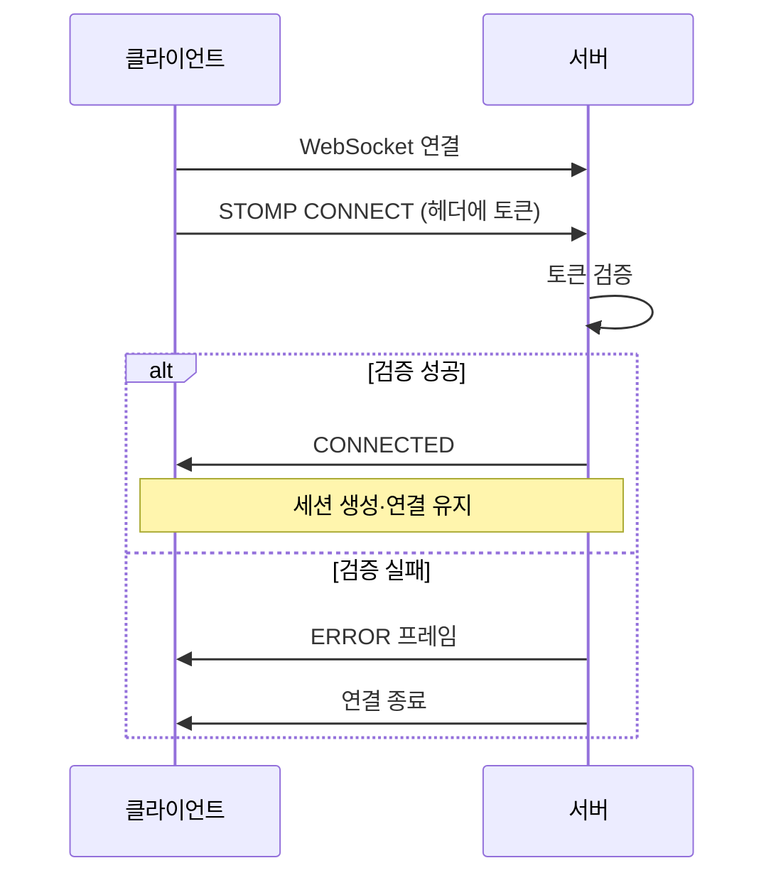
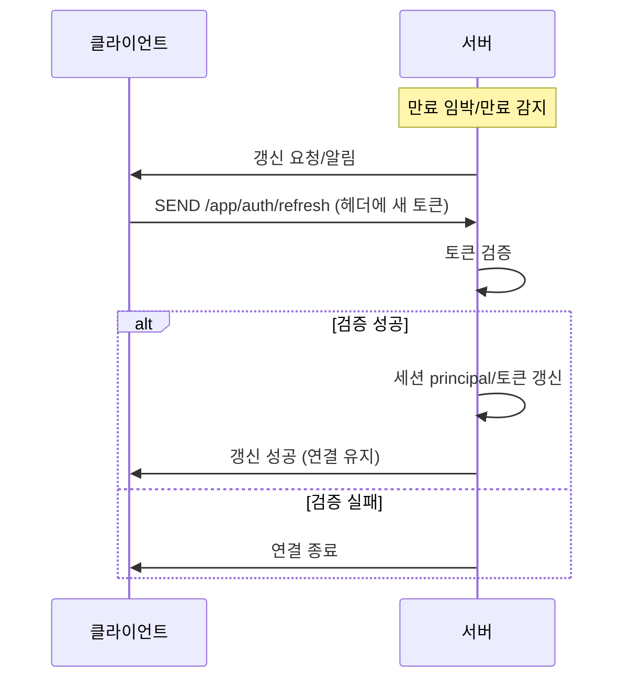
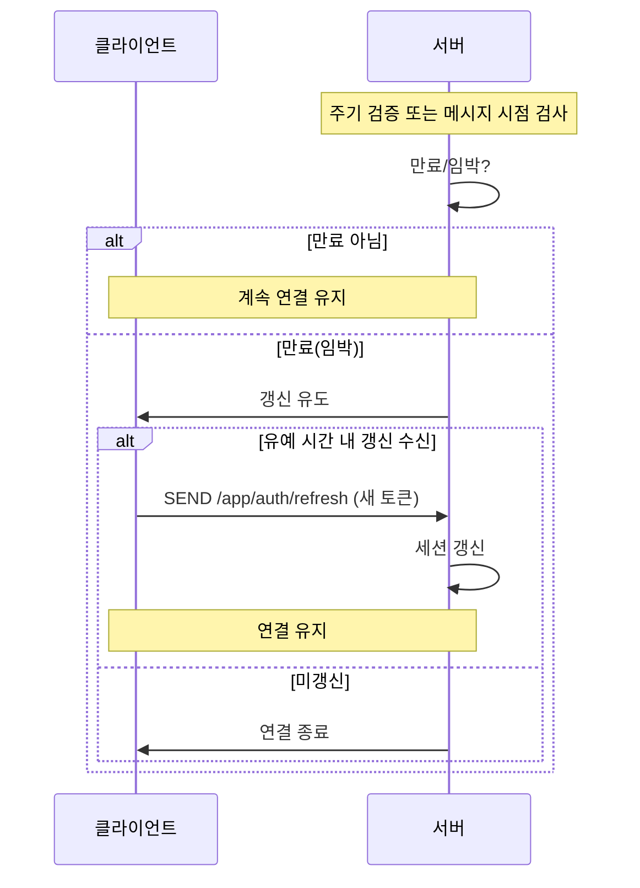

## 프로젝트 요약

- **한 줄 요약**: WebSocket 인증 방식을 개선하여 토큰 노출을 줄이고, 구독 권한 검증 및 권한 기반 메시지 전달로 미인가 접근을 차단합니다.
- **진행/소속**: 개인프로젝트
- **키워드**: `WebSocket`, `인증`, `인가`, `STOMP`, `채널 구독`

## 문제(AS-IS)

- 인가되지 않은 사용자가 **다른 사용자 채널을 구독**할 수 있는 가능성
- 인가가 **취소된 사용자**가 계속 메시지를 수신할 수 있는 가능성
- 토큰을 **쿼리 파라미터**로 전달해 서버 로그 등에 노출될 위험

## 목표(TO-BE)

- **권한 기반 메시지 전달**: 사용자 권한에 따라 메시지가 전달되도록 하여, 인가가 취소된 사용자의 메시지 수신 가능성 제거
- **인증 정보 노출 최소화**: 인증 정보가 서버 로그 등에 노출되지 않도록 전달 방식 개선
- **구독 권한 검증**: 구독 대상에 대한 접근 권한을 검증하여, 인가되지 않은 구독 차단

## 설계/선택(Key decisions)

(구현 후 채울 예정)

## 결과(Impact)

(구현 후 채울 예정)

---

## 구현 상세

**목차**
1. 권한 기반 메시지 전달 구조
2. 인증 정보 전달 방식 변경
3. 위 규칙에 따른 문서 개선

---

### 1) 권한 기반 메시지 전달 구조

**배경**: 현재는 채팅방·토픽 단위로 메시지를 브로드캐스트하고 있어, 한 번 구독한 사용자는 인가가 취소되어도 해당 채널로 계속 메시지가 전달될 수 있음. “이 사용자에게만 보낸다”는 단위가 없어, 권한 회수 시 메시지 수신을 끊을 수 없음. 따라서 사용자(또는 권한) 단위로 전달 대상을 나누어, 권한에 맞는 대상에게만 메시지를 보내는 구조가 필요함.

**해결방안 후보**:
- **A. 유저별 전용 채널**
  - (설명) 사용자마다 전용 토픽(예: `/user/{userId}/messages`)을 두고, 해당 유저에게 보낼 메시지만 그 채널로 전송. 권한 회수 시 해당 채널로 더 이상 보내지 않으면 됨.
  - (장점) “이 유저에게만 보낸다”가 명확함. 인가 취소 시 메시지 차단이 구조적으로 가능.
  - (단점) 1:1·DM 위주에 적합. 채팅방처럼 다수 수신자는 채널 조합 또는 별도 토픽 설계 필요.
- **B. 채팅방 토픽 + 구독 시 권한 검증**
  - (설명) 기존처럼 채팅방·토픽 단위 유지. 구독 시 “이 사용자가 이 채널 접근 권한 있는지”만 검증. 전송은 기존 브로드캐스트 유지.
  - (장점) 기존 구조 변경이 적음. 채팅방 다수 참여자 모델에 맞음.
  - (단점) 구독 후 권한이 취소되면, 별도로 연결 종료하거나 메시지 필터링 로직이 필요함. “이 유저에게만” 전달 단위는 아님.
- **C. 유저별 채널 + 채팅방 토픽 혼합**
  - (설명) 1:1/알림 등은 유저별 채널(A), 채팅방 메시지는 채팅방 토픽(B) + 구독 권한 검증. 유형별로 적용.
  - (장점) 1:1은 권한 기반 전달, 채팅방은 기존 모델 유지 가능.
  - (단점) 토픽 종류·클라이언트 구독 로직이 늘어남.

**실제 서비스 참고**:
- **Slack**: Events API(Socket Mode) 사용. OAuth 권한 스코프에 따라 받는 이벤트가 제한됨. 앱이 멤버인 채널·DM만 구독·수신. “채널 단위 + 구독 권한에 따른 이벤트 필터” 방식.
- **Discord**: Gateway(WebSocket)로 연결 후, 서버가 “이 사용자가 접근 가능한” 길드·채널·DM 기준으로 이벤트만 전송. 클라이언트는 하나의 스트림으로 자기에게 허용된 이벤트만 수신 → **사용자 단위 스트림**에 가깝게 동작.
- **Firebase / FCM**: 채널 브로드캐스트가 아니라 **대상(기기 토큰·유저 토픽) 단위 푸시**. “이 유저/기기에게만” 전달이 기본 단위. 실시간 채팅도 보통 유저별 토큰/토픽으로 타깃팅.

**선택**: **A. 유저별 전용 채널**.
- **이유**:
  1. “권한 기반 메시지 전달”과 “인가 취소 시 수신 차단” 목표에 가장 잘 맞음. 해당 유저 채널로만 보내면 되고, 권한 회수 시 그 채널로 더 이상 보내지 않으면 됨.
  2. 채팅방도 “참여자 각자의 유저 채널로 전송”하면 됨. 채널 종류를 유저 단위 하나로 통일할 수 있고, Discord처럼 사용자 단위 스트림으로 정리 가능.
  3. 이미 실시간 통신 최적화(WebSocket vs SSE) 작업에서 Redis Pub/Sub으로 수평 확장·메시지 라우팅을 구현해 두었음. 유저별 채널로 가도 동일한 Pub/Sub 패턴으로 “유저 채널 → 해당 서버” 라우팅이 가능함.
- **트레이드오프**: 
  1. 채팅방 메시지는 참여자 수만큼 유저 채널로 전송되므로 트래픽이 늘 수 있음.
     - 유저에 따른 서버(Redis, WebSocket)를 할당하는 방식으로 Throughput 개선 가능. 

**변경 클래스**
- `MessageCommandEvent.Send` — 수신자 지정용 `recipientUserId` 필드 추가, 생성 시 주입
- `MessageCommandEventDispatcher` — 유저별로 `Send.from(event, recipientUserId = it)` 생성 후 relay에 전달
- `MessageCommandEventRelayRedisRepository` — 이미 `recipientUserId`가 설정된 Send를 유저별 토픽으로 그대로 발행
- `MessageWebSocketController` — `Send` 리스너에서 SPEL 토픽 `/topic/user/{recipientUserId}/messages`로만 전송, 채팅방 토픽 브로드캐스트 제거
- `WebSocketConfig` — `ClientInboundChannel`에 구독 권한 검증 인터셉터 등록
- (신규) `WebSocketTopicSubscribeInterceptor` — SUBSCRIBE 시 `/topic/user/{uuid}/...`의 uuid가 principal과 일치하는지 검증, 불일치 시 구독 거부

**작업 결과**
- **형식**: `/topic/user/{uuid}/리소스명` (예: `/topic/user/{uuid}/messages`).
  - 같은 유저의 다중 세션을 지원하기 위해 topic 사용
- **구독**: 본인 userId 토픽만. destination uuid = 토큰 uuid 검증하는 작업 추가 예정
- **전송**: 수신 유저 토픽으로만 전송. 채팅방 = 참여자 수만큼 각 유저 채널로.
- **권한**: 인가 취소 시 해당 채널로 미전송. 2번과 연동 시 타 유저 채널 구독 차단.

---

### 2) 인증 정보 전달 방식 변경

**목적**: 토큰·사용자 정보를 쿼리 파라미터 대신 안전한 방식으로 전달하도록 클라이언트/서버 수정

**후보**:
- **A. Handshake 시 HTTP 헤더**
  - (장점) 로그/Referer에 토큰이 남지 않음. REST API와 동일한 `Authorization` 헤더 사용 가능.
  - (단점) 브라우저 기본 WebSocket API는 헤더 지정 불가. SockJS·STOMP 등 **클라이언트 라이브러리도 Handshake 헤더를 잘 지원하지 않음**.
- **B. STOMP CONNECT 시 헤더**
  - (장점) 구현 단순, 클라이언트 제약 적음. Handshake는 토큰 없이 하고 STOMP 단에서만 인증.
  - (단점) WebSocket은 이미 열린 뒤라, 인증 실패 시 연결을 끊는 방식으로 처리해야 함.
- **C. Cookie**
  - (장점) 연결 시 쿠키 자동 전송. 클라이언트 코드에서 토큰을 직접 다룰 필요 없음.
  - (단점) `SameSite`/`Secure`·도메인 정리 필요. WebSocket은 동일 오리진에서만 쿠키 전송.
- **D. 각 STOMP 메시지마다 헤더에 토큰**
  - (장점) CONNECT뿐 아니라 SUBSCRIBE·SEND 등 메시지 단위로 인증 가능. 토큰 갱신/만료 시 해당 메시지만 거절하면 됨.
  - (단점) 매 메시지에 토큰 포함으로 트래픽·클라이언트 보일러플레이트 증가. 서버도 메시지마다 검증 필요.

**선택**: **B. STOMP CONNECT 시 헤더**.

**플로우** (시퀀스 다이어그램)

**1. CONNECT**

**2. 연결 유지 중 토큰 갱신**

**3. 만료(임박) 시 처리** *(미구현)*

- **현재 상태**: 아래 플로우(서버가 만료/임박 감지 → 갱신 유도 → 유예 후 미갱신 시 연결 종료)는 **아직 구현되어 있지 않음**. 갱신 API(`/app/auth/refresh`)만 제공 중이며, 만료 감지·유도·유예 종료는 미구현.

- **이유**:
  1. 연결 시 한 번만 인증하면 되고, 토큰 노출 없이 구현·운영이 단순함.
  2. A는 클라이언트 라이브러리 지원이 약해 현실적으로 B가 적합함.
- **트레이드오프**:
  1. 연결 시 한 번만 검증하므로, 토큰 유효 기간이 짧으면 연결 중 만료될 수 있음.
     - 해결 방안: 만료(또는 만료 임박) 감지 시 **즉시 연결 종료하지 않고**, 먼저 갱신 기회를 준 뒤, **갱신 실패 또는 유예 시간 내 미갱신 시에만** 연결 종료. (연결 유지 중 토큰 갱신(아래 3번)이 있으므로, 끊기 전에 한 번 갱신을 시도할 수 있어야 함.)
     - 만료 감지 방법(후보):
       - **서버 주기 검증**: Heartbeat/스케줄러로 토큰(또는 JWT `exp`) 검사 → 만료(임박) 시 클라이언트에 갱신 요청/알림 전송 → 유예 시간 내 갱신 요청 수신 시 세션 갱신·연결 유지, 미갱신 시 연결 종료.
       - **클라이언트 주도**: 클라이언트가 만료 시점을 알고 만료 직전에 전용 destination으로 새 토큰 전송. 서버는 별도 만료 감지 없이 갱신만 처리.
       - **메시지 시점 검사**: SUBSCRIBE/SEND 처리 시 토큰 만료(임박) 확인 → 만료(임박) 시 갱신 유도 후, 유예 내 미갱신 시 연결 종료.
  2. 인증 실패 시 WebSocket은 이미 열린 뒤이므로, CONNECT 단계에서 연결 종료로만 처리 가능.
     - 해결 방안: CONNECT 검증 실패 시 ERROR 프레임 반환 후 연결 종료. 클라이언트는 재로그인 유도.
  3. **연결 유지 중 토큰 갱신**: 토큰 만료 전에 새 토큰으로 갱신할 수단이 있어야 함(재연결 없이 연결 유지).
     - 후보:
       - **전용 destination**: 예) `/app/auth/refresh` 등으로 클라이언트가 새 토큰을 헤더에 담아 SEND → 서버가 검증 후 해당 세션의 principal/토큰 갱신. 연결은 유지.
       - **재연결만 허용**: 만료 감지 시 연결 종료 후 클라이언트가 새 토큰으로 CONNECT. 구현 단순하나 연결이 끊김.
     - 선택 시 갱신 API 규격(헤더 이름, destination, 실패 시 처리)을 정리할 것.

---

**→ To be continued.** 남은 작업(갱신 API 규격 정리, **만료(임박) 시 처리** 서버 로직, 3) 위 규칙에 따른 문서 개선, 설계/선택·결과 채우기 등)은 **오늘자 패치노트** [day6-01-웹소켓보안개선-이어하기](../week-2026-02-02/day6-01-웹소켓보안개선-이어하기.md)에서 이어서 진행합니다.
