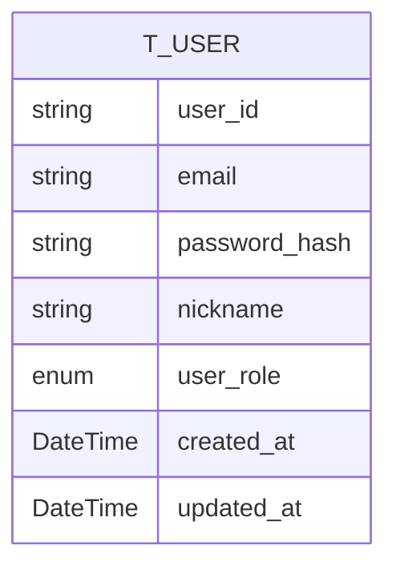
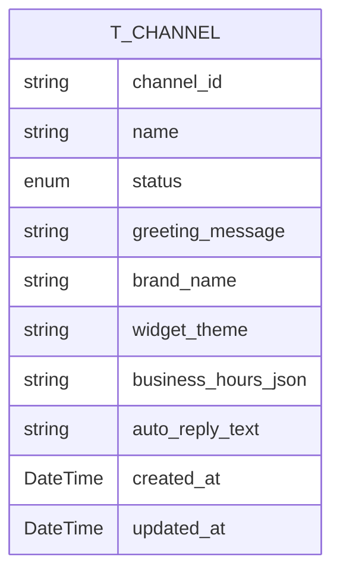
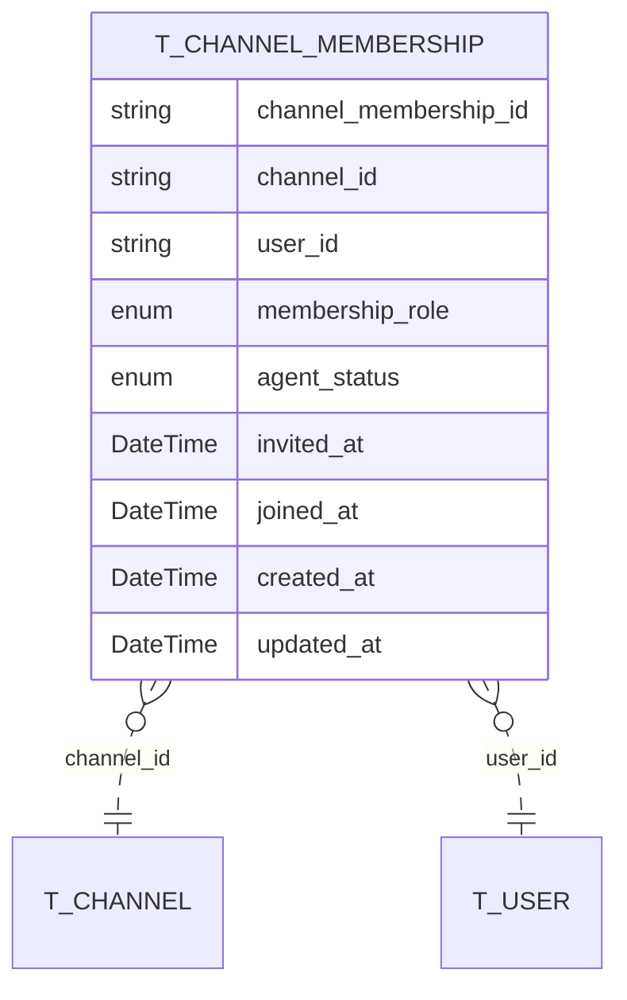
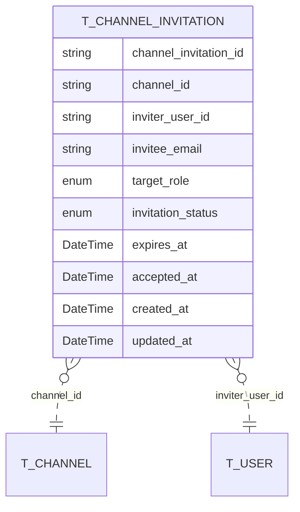
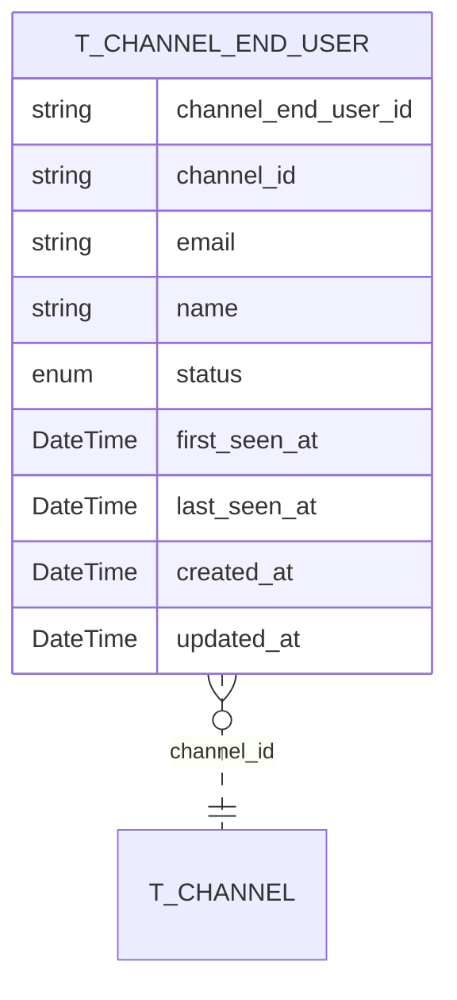
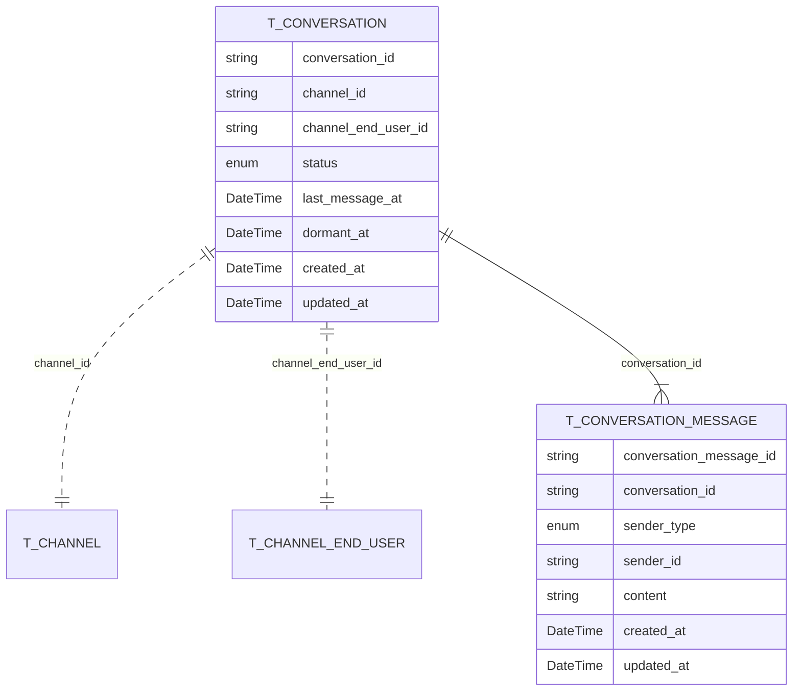

# 📊 Aggregate Root Design / AR 설계

## 📝 Overview / 개요

This document defines the aggregate-root-oriented domain design for the admin and messaging domain.  
이 문서는 어드민 및 메시징 도메인을 위한 AR(Aggregate Root) 중심 도메인 설계를 정의합니다.

The design is centered on three actors: Platform Admin, Channel User, and ChannelEndUser.  
이 설계는 Platform Admin, Channel User, ChannelEndUser의 세 가지 존재를 중심으로 합니다.

## ⚙️ Common Considerations / 공통 고려사항

- **Tenant boundary / 테넌트 경계**: `Channel` is the tenant boundary. One customer company owns exactly one channel.  
  `Channel`이 테넌트 경계이며, 고객사 하나는 정확히 하나의 채널을 가집니다.
- **Aggregate-root-oriented design / AR 중심 설계**: each table group is organized around one aggregate root and its owned entities.  
  각 테이블 그룹은 하나의 Aggregate Root와 그 내부 소유 엔티티를 기준으로 구성합니다.
- **Role split / 역할 분리**: global role(for `Platform Admin`, `Channel User`) and channel role(for `Channel User`) must be separated.  
  전역 역할(`Platform Admin`, `Channel User`)과 채널 역할(`Channel User`)은 분리되어야 합니다.
- **Identity split / 식별 분리**: backoffice users and channel end users must not share the same identity model.  
  백오피스 사용자와 채널 엔드유저는 동일한 식별 모델을 공유하지 않습니다.
- **Enum fields / Enum 필드**: role and status values are modeled as enum in the domain and should be documented with explicit allowed values.  
  role 및 status 값은 도메인에서 enum으로 모델링하며, 문서에도 허용 값을 명시합니다.
- **Audit fields / 감사 필드**: all tables include `created_at` and `updated_at`.  
  모든 테이블은 `created_at`, `updated_at`을 포함합니다.
- **ID policy / ID 정책**: all IDs are string type.  
  모든 ID는 string 타입입니다.

## 📄 Writing Convention / 문서 작성 방식

- The design is grouped by aggregate root, not by technical package.  
  설계는 기술 패키지 기준이 아니라 Aggregate Root 기준으로 묶습니다.
- Each section explains table structure and why the aggregate boundary exists.  
  각 섹션은 테이블 구조와 aggregate 경계가 필요한 이유를 함께 설명합니다.
- Referenced aggregates are shown by table name only when the detailed fields are already explained elsewhere.  
  다른 섹션에서 상세 필드를 설명한 aggregate는 참조 시 테이블명만 표시합니다.

## 👤 User Aggregate / 사용자 AR

### Aggregate Responsibility / AR 책임

- `User` is the identity root for backoffice actors.  
  `User`는 백오피스 행위자의 식별 루트입니다.
- It represents platform admins and customer-company staff.  
  운영 어드민과 고객사 직원을 모두 표현합니다.
- It does not represent widget customers.  
  위젯 고객은 표현하지 않습니다.
- It owns only backoffice identity and authentication state.  
  백오피스 식별과 인증 상태만 소유합니다.

### T_USER

| Field / 필드명  | Type / 타입 | Description / 설명                                        |
| --------------- | ----------- | --------------------------------------------------------- |
| `user_id`       | string      | Backoffice user identifier / 백오피스 사용자 식별자       |
| `email`         | string      | Login email / 로그인 이메일                               |
| `password_hash` | string      | Password hash / 비밀번호 해시                             |
| `nickname`      | string      | Display name / 표시 이름                                  |
| `user_role`     | Enum        | Global role / 전역 역할 |
| `created_at`    | DateTime    | Created time / 생성 일시                                  |
| `updated_at`    | DateTime    | Updated time / 수정 일시                                  |

### Special Field Notes / 특수 필드 설명

- **`user_role`** only answers platform-level authorization questions.  
  **`user_role`**은 플랫폼 레벨 권한만 표현합니다.
- **Channel ownership is not stored in `T_USER` / 채널 소속은 `T_USER`에 저장하지 않음**: channel belonging must be resolved only through `T_CHANNEL_MEMBERSHIP`.  
  채널 소속은 오직 `T_CHANNEL_MEMBERSHIP`을 통해서만 해석해야 합니다.
- **`user_role`** has the following values / **`user_role`** 은 아래 값을 가집니다:
  - `PLATFORM_ADMIN`
  - `CHANNEL_USER`

### Design Rationale / 설계 이유

- **Separate global authority / 전역 권한 분리**: platform-level permissions must not be mixed with channel-level permissions.  
  플랫폼 레벨 권한과 채널 레벨 권한을 분리해야 합니다.
- **Single identity for backoffice / 백오피스 단일 식별자**: all internal actors should log in through `User`.  
  내부 행위자는 모두 `User`를 통해 로그인합니다.
- **Membership-owned belonging / 멤버십 중심 소속 관리**: a user may be a platform admin without belonging to any channel, so channel ownership must not be mandatory in `User`.  
  운영 어드민은 어떤 채널에도 속하지 않을 수 있으므로, `User`에 채널 소속을 필수로 두면 안 됩니다.
- **No ChannelEndUser mixing / ChannelEndUser 분리**: widget customers have a different lifecycle and must be separated.  
  위젯 고객은 생명주기가 다르므로 분리해야 합니다.

## 🏢 Channel Aggregate / 채널 AR

### Aggregate Responsibility / AR 책임

- `Channel` is the tenant root (customer company).  
  `Channel`은 테넌트 루트(고객사)입니다.
- It owns channel configuration, channel-scoped users, end users, and conversations.  
  채널 설정, 채널 소속 사용자, 엔드유저, 대화의 상위 경계를 형성합니다.
- It owns tenant-level configuration and lifecycle state.  
  테넌트 레벨 설정과 수명주기 상태를 소유합니다.

### T_CHANNEL

| Field / 필드명        | Type / 타입 | Description / 설명                               |
| --------------------- | ----------- | ------------------------------------------------ |
| `channel_id`          | string      | Tenant identifier / 테넌트 식별자                |
| `name`                | string      | Channel name / 채널명                            |
| `status`              | Enum        | Channel status / 채널 상태                       |
| `greeting_message`    | string      | Greeting shown in widget / 위젯 인사말           |
| `brand_name`          | string      | Customer-facing brand name / 고객 노출 브랜드명  |
| `widget_theme`        | string      | Widget appearance configuration / 위젯 외형 설정 |
| `business_hours_json` | string      | Business hour settings / 운영 시간 설정          |
| `auto_reply_text`     | string      | Auto-reply text / 자동응답 문구                  |
| `created_at`          | DateTime    | Created time / 생성 일시                         |
| `updated_at`          | DateTime    | Updated time / 수정 일시                         |

### Special Field Notes / 특수 필드 설명

- **`status`** has the following values / **`status`** 는 아래 값을 가집니다:
  - `INACTIVE`: channel exists but is not yet operating or deactivated / 채널은 존재하지만 아직 운영 전 또는 비활성화됨
  - `ACTIVE`: channel is operating normally / 채널이 정상 운영 중
  - `SUSPENDED`: channel is temporarily blocked by platform operation / 플랫폼 운영에 의해 일시 중지됨
  - `ARCHIVED`: channel is no longer used and is archived / 더 이상 사용하지 않는 보관 상태

### Design Rationale / 설계 이유

- **Tenant root / 테넌트 루트**: billing, access boundary, and customer ownership are all channel-based.  
  과금, 접근 경계, 고객사 소유 단위가 모두 채널 기준입니다.
- **Limited customer configuration / 고객사 수정 범위 제한**: customers can modify safe operational settings, while platform admins keep control of billing and critical platform policies.  
  고객사는 자사 운영 설정 일부만 수정하고, 결제와 핵심 운영 정책은 플랫폼이 유지합니다.

## 👥 ChannelMembership Aggregate / 채널 멤버십 AR

### Aggregate Responsibility / AR 책임

- `ChannelMembership` represents the relationship between a backoffice user and a channel.  
  `ChannelMembership`는 백오피스 사용자와 채널 간의 관계를 나타냅니다.
- `ChannelMembership` is the channel-scoped authorization root for backoffice users.  
  `ChannelMembership`는 백오피스 사용자의 채널 권한 루트입니다.
- It decides whether a user is a customer admin or an agent.  
  고객사 관리자와 상담원을 구분합니다.
- It owns channel-scoped authorization and participation state.  
  채널 범위의 권한과 참여 상태를 소유합니다.

### T_CHANNEL_MEMBERSHIP

| Field / 필드명          | Type / 타입 | Description / 설명                                            |
| ----------------------- | ----------- | ------------------------------------------------------------- |
| `channel_membership_id` | string      | Membership identifier / 멤버십 식별자                         |
| `channel_id`            | string      | Channel reference / 채널 참조                                 |
| `user_id`               | string      | Backoffice user reference / 백오피스 사용자 참조              |
| `membership_role`       | Enum        | Channel role: `ADMIN`, `AGENT` / 채널 역할                    |
| `agent_status`          | Enum        | Agent state such as `ONLINE`, `AWAY`, `OFFLINE` / 상담원 상태 |
| `invited_at`            | DateTime    | Invitation time / 초대 시각                                   |
| `joined_at`             | DateTime    | Join completion time / 가입 완료 시각                         |
| `created_at`            | DateTime    | Created time / 생성 일시                                      |
| `updated_at`            | DateTime    | Updated time / 수정 일시                                      |

### Special Field Notes / 특수 필드 설명

- **`membership_role`** has the following values / **`membership_role`** 은 아래 값을 가집니다:
  - `ADMIN`
  - `AGENT`
- **`agent_status`** has the following values / **`agent_status`** 은 아래 값을 가집니다:
  - `ONLINE`
  - `AWAY`
  - `OFFLINE`

### Design Rationale / 설계 이유

- **Separate channel role / 채널 역할 분리**: customer admin vs agent is not a global role.  
  고객사 관리자와 상담원은 전역 역할이 아닙니다.
- **Operational flexibility / 운영 유연성**: the UI may stay the same while permissions differ by role.  
  UI는 같게 유지하면서도 역할에 따라 capability를 다르게 할 수 있습니다.
- **Belonging and authorization together / 소속과 권한의 동시 관리**: channel belonging is resolved through membership, so the membership aggregate becomes the natural place for channel-scoped invariants.  
  채널 소속이 membership을 통해 해석되므로, membership aggregate가 채널 범위 불변조건의 자연스러운 위치가 됩니다.
- **Future-proof identity boundary / 미래 확장성**: even if the current policy is one user to one channel, membership is still the correct boundary for authorization.  
  현재는 한 사용자가 한 채널만 속하더라도, 권한 경계는 membership이 맞습니다.

## ✉️ ChannelInvitation Aggregate / 채널 초대 AR

### Aggregate Responsibility / AR 책임

- `ChannelInvitation` is the invitation root for onboarding customer-company staff.  
  `ChannelInvitation`은 고객사 직원을 온보딩하기 위한 초대 루트입니다.
- It owns the invitation lifecycle before membership becomes active.  
  membership이 활성화되기 전의 초대 수명주기를 소유합니다.

### T_CHANNEL_INVITATION

| Field / 필드명          | Type / 타입 | Description / 설명                                       |
| ----------------------- | ----------- | -------------------------------------------------------- |
| `channel_invitation_id` | string      | Invitation identifier / 초대 식별자                      |
| `channel_id`            | string      | Target channel / 대상 채널                               |
| `inviter_user_id`       | string      | Inviter reference / 초대한 사용자                        |
| `invitee_email`         | string      | Invitee email / 초대 대상 이메일                         |
| `target_role`           | Enum        | Target membership role / 초대 대상 역할                  |
| `invitation_status`     | Enum        | `PENDING`, `ACCEPTED`, `EXPIRED`, `CANCELED` / 초대 상태 |
| `expires_at`            | DateTime    | Expiration time / 만료 시각                              |
| `accepted_at`           | DateTime    | Acceptance time / 수락 시각                              |
| `created_at`            | DateTime    | Created time / 생성 일시                                 |
| `updated_at`            | DateTime    | Updated time / 수정 일시                                 |

### Special Field Notes / 특수 필드 설명

- **`target_role`** has the following values / **`target_role`** 은 아래 값을 가집니다:
  - `ADMIN`
  - `AGENT`
- **`invitation_status`** has the following values / **`invitation_status`** 은 아래 값을 가집니다:
  - `PENDING`
  - `ACCEPTED`
  - `EXPIRED`
  - `CANCELED`

### Design Rationale / 설계 이유

- **Email-based onboarding / 이메일 기반 온보딩**: the product policy already chose email invitation.  
  제품 정책에서 이메일 초대를 채택했습니다.
- **Separate invitation lifecycle / 초대 생명주기 분리**: invitation state should not be mixed into membership state.  
  초대 상태는 membership 상태와 분리해야 합니다.

## 🙋 ChannelEndUser Aggregate / 채널 엔드유저 AR

### Aggregate Responsibility / AR 책임

- `ChannelEndUser` is the identity root for widget customers.  
  `ChannelEndUser`는 위젯 고객의 식별 루트입니다.
- It is channel-scoped and identified by email.  
  채널 단위로 존재하며 이메일로 식별합니다.
- A user can have multiple `ChannelEndUser` records across different channels but only one per channel.  
  한 사용자는 여러 채널을 통틀어 여러 `ChannelEndUser` 레코드를 가질 수 있지만, 채널당 하나만 가질 수 있습니다.
- It owns customer identity and customer-level lifecycle state inside a channel.  
  채널 내부에서 고객 식별과 고객 레벨 수명주기 상태를 소유합니다.

### T_CHANNEL_END_USER

| Field / 필드명  | Type / 타입 | Description / 설명                                                |
| --------------- | ----------- | ----------------------------------------------------------------- |
| `channel_end_user_id` | string | Channel end-user identifier / 채널 엔드유저 식별자               |
| `channel_id`    | string      | Owning channel / 소속 채널                                        |
| `email`         | string      | Required unique email within channel / 채널 내 유일한 필수 이메일 |
| `name`          | string      | Display name / 표시 이름                                          |
| `status`        | Enum        | End-user status / 엔드유저 상태                                   |
| `first_seen_at` | DateTime    | First identified time / 최초 식별 시각                            |
| `last_seen_at`  | DateTime    | Last activity time / 마지막 활동 시각                             |
| `created_at`    | DateTime    | Created time / 생성 일시                                          |
| `updated_at`    | DateTime    | Updated time / 수정 일시                                          |

### Special Field Notes / 특수 필드 설명

- **`status`** has the following values / **`status`** 은 아래 값을 가집니다:
  - `ACTIVE`
  - `BLOCKED`
  - `ARCHIVED`

### Design Rationale / 설계 이유

- **Dedicated customer identity / 고객 전용 식별자**: channel end users are not employees and must not share `User`.  
  채널 엔드유저는 직원이 아니므로 `User`와 분리해야 합니다.
- **Email-based identity / 이메일 기반 식별**: product policy requires email before a real conversation starts.  
  본격 대화 전에 이메일을 받아야 하므로 이메일 기반 식별이 적합합니다.
- **Channel-local identity / 채널 지역 식별**: the same email in another channel is a different tenant-local channel end user.  
  다른 채널의 같은 이메일은 다른 테넌트 로컬 채널 엔드유저입니다.

## 💬 Conversation Aggregate / 대화 AR

### Aggregate Responsibility / AR 책임

- `Conversation` is the long-lived interaction root between a channel and an end user.  
  `Conversation`은 채널과 엔드유저 사이의 장기 상호작용 루트입니다.
- One end user owns one ongoing conversation per channel even though the time gap between interactions may be long.  
  한 엔드유저는 한 채널에서 하나의 ongoing conversation을 가집니다. 상호작용 간 시간 간격이 길어도 하나의 conversation만 유지됩니다.
- `T_CONVERSATION_MESSAGE` is an internal entity owned by `Conversation`.  
  `T_CONVERSATION_MESSAGE`는 `Conversation`이 소유하는 내부 엔티티입니다.
- Multiple agents can participate in a conversation with one end user.  
  여러 에이전트가 한 명의 엔드유저와 대화에 참여할 수 있습니다.
- It owns conversation lifecycle and timeline state.  
  대화 수명주기와 타임라인 상태를 소유합니다.

### T_CONVERSATION

| Field / 필드명    | Type / 타입 | Description / 설명                         |
| ----------------- | ----------- | ------------------------------------------ |
| `conversation_id` | string      | Conversation identifier / 대화 식별자      |
| `channel_id`      | string      | Channel reference / 채널 참조              |
| `channel_end_user_id` | string  | Channel end-user reference / 채널 엔드유저 참조 |
| `status`          | Enum        | `ACTIVE`, `DORMANT` / 대화 상태            |
| `last_message_at` | DateTime    | Last message time / 마지막 메시지 시각     |
| `dormant_at`      | DateTime    | Dormant transition time / 휴지기 진입 시각 |
| `created_at`      | DateTime    | Created time / 생성 일시                   |
| `updated_at`      | DateTime    | Updated time / 수정 일시                   |

### Special Field Notes / 특수 필드 설명

- **`status`** has the following values / **`status`** 은 아래 값을 가집니다:
  - `ACTIVE`
  - `DORMANT`

### T_CONVERSATION_MESSAGE

| Field / 필드명            | Type / 타입 | Description / 설명                                        |
| ------------------------- | ----------- | --------------------------------------------------------- |
| `conversation_message_id` | string      | Message identifier / 메시지 식별자                        |
| `conversation_id`         | string      | Conversation reference / 대화 참조                        |
| `sender_type`             | Enum        | Sender type / 발신자 유형                                 |
| `sender_id`               | string      | Sender identifier / 발신자 식별자                         |
| `content`                 | string      | Message content / 메시지 내용                             |
| `created_at`              | DateTime    | Created time / 생성 일시                                  |
| `updated_at`              | DateTime    | Updated time / 수정 일시                                  |

### Special Field Notes / 특수 필드 설명

- **`sender_type`** has the following values / **`sender_type`** 은 아래 값을 가집니다:
  - `CHANNEL_USER`
  - `END_USER`

### Design Rationale / 설계 이유

- **One ongoing conversation / 단일 ongoing conversation**: the same end user should continue the same conversation in the same channel.  
  같은 엔드유저는 같은 채널에서 같은 대화를 이어가야 합니다.
- **Dormant instead of close / 종료 대신 휴지기**: after 7 days of inactivity, the conversation becomes dormant rather than closed.  
  7일 무응답 이후에는 종료가 아니라 휴지기로 전환합니다.
- **UI-level restart hint / UI 레벨 재시작 표시**: after dormancy, the admin panel should show that a new interaction has started, while keeping the same conversation boundary in the domain.  
  휴지기 이후에는 도메인 경계는 같은 conversation을 유지하되, 관리자 UI에서는 새로운 상호작용이 시작되었음을 표시해야 합니다.
- **Simple timeline model / 단순 타임라인 모델**: the first version keeps conversation messages as simple chat messages and postpones richer timeline event modeling.  
  1차 버전에서는 conversation message를 단순 채팅 메시지로 유지하고, 더 풍부한 타임라인 이벤트 모델링은 추후로 미룹니다.

## 🎫 Ticket Aggregate (Future Plan) / 티켓 AR (미래 계획)

### Aggregate Responsibility / AR 책임

- `Ticket` is a candidate aggregate for a future phase.  
  `Ticket`은 추후 단계에서 도입할 후보 aggregate입니다.
- It may be introduced when issue-level tracking becomes necessary inside a conversation.  
  conversation 내부에서 이슈 단위 추적이 필요해질 때 도입할 수 있습니다.

### Design Rationale / 설계 이유

- **Issue-level clarity / 이슈 단위 가시성**: ticket can help summarize issue context and post-analysis when conversation-level tracking becomes insufficient.  
  conversation 수준 추적만으로 부족해질 때 ticket은 이슈 맥락과 사후 분석에 도움을 줄 수 있습니다.
- **Separated rollout / 분리된 도입 가능성**: ticket can be introduced later without changing the current one-conversation-per-user policy.  
  ticket은 현재의 1유저-1대화 정책을 바꾸지 않고도 나중에 도입할 수 있습니다.

## 🔁 Current Resource Migration / 현재 리소스 전환 방향

| Current Resource / 현재 리소스   | Target Direction / 목표 방향                                   |
| -------------------------------- | -------------------------------------------------------------- |
| `UserRole.ADMIN`                 | `UserRole.PLATFORM_ADMIN`                                      |
| `UserRole.USER`                  | `UserRole.CHANNEL_USER`                                        |
| `CommonAuthRole.ADMIN/USER`      | align to global role semantics / 전역 역할 의미에 맞게 정렬    |
| `ChannelOperator`                | evolve into `ChannelMembership` / `ChannelMembership`으로 전환 |
| `ChannelConversation.customerId` | replace with `channel_end_user_id` / `channel_end_user_id`로 전환 |
| generic widget identity          | introduce dedicated `ChannelEndUser` / 전용 `ChannelEndUser` 도입 |

## ✅ Summary / 정리

- `User` is the AR for backoffice identity.  
  `User`는 백오피스 식별 AR입니다.
- `ChannelMembership` is the AR for channel-scoped authorization.  
  `ChannelMembership`는 채널 권한 AR입니다.
- `ChannelEndUser` is the AR for widget customer identity.  
  `ChannelEndUser`는 위젯 고객 식별 AR입니다.
- `Conversation` is the AR for long-lived customer interaction.  
  `Conversation`은 장기 고객 상호작용 AR입니다.
- `Ticket` is a future candidate aggregate for issue-level tracking.  
  `Ticket`은 이슈 단위 추적을 위한 추후 후보 aggregate입니다.
