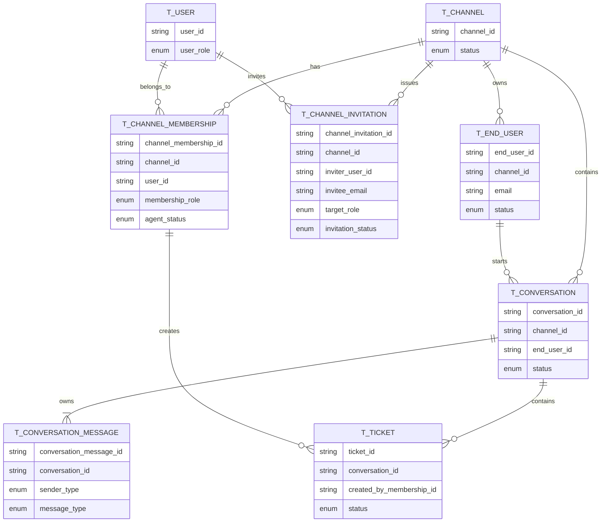

# 🗺️ ERD / 전체 ERD

## 📝 Overview / 개요

This document shows the high-level entity relationship diagram for the admin and messaging domain.  
이 문서는 어드민 및 메시징 도메인의 상위 엔티티 관계도를 보여줍니다.

The model is centered on three actors: Platform Admin, Channel User, and EndUser.  
모델은 Platform Admin, Channel User, EndUser의 세 가지 존재를 중심으로 구성됩니다.

## 📊 ERD

## 📌 Notes / 설명

- `T_USER` stores only backoffice identity and global role.  
  `T_USER`는 백오피스 식별과 전역 역할만 저장합니다.

- Channel-scoped authorization is resolved through `T_CHANNEL_MEMBERSHIP`.  
  채널 범위 권한은 `T_CHANNEL_MEMBERSHIP`을 통해 해석합니다.

- `T_END_USER` is separated from `T_USER` and belongs to a channel.  
  `T_END_USER`는 `T_USER`와 분리되어 있으며 채널에 속합니다.

- `T_CONVERSATION_MESSAGE` is an internal entity owned by `T_CONVERSATION`.  
  `T_CONVERSATION_MESSAGE`는 `T_CONVERSATION`이 소유하는 내부 엔티티입니다.

- `T_TICKET` is an internal operational aggregate inside a conversation, created by channel staff.  
  `T_TICKET`은 conversation 내부의 운영용 aggregate이며 채널 직원이 생성합니다.
