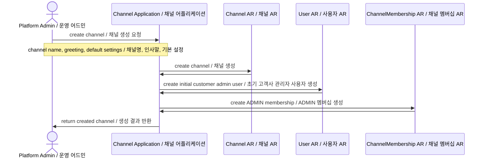
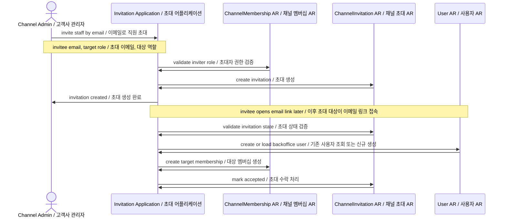
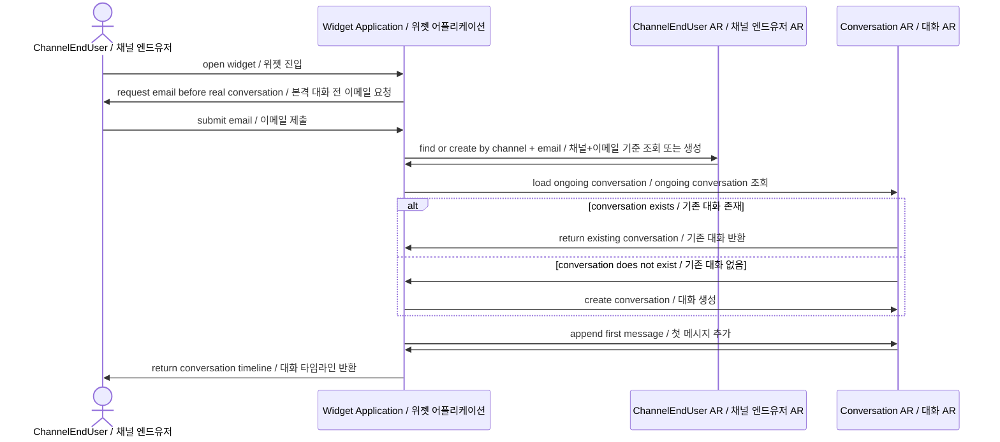
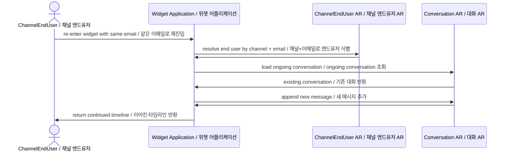
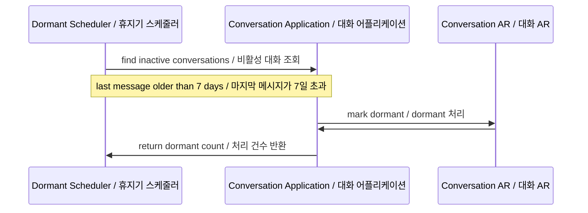
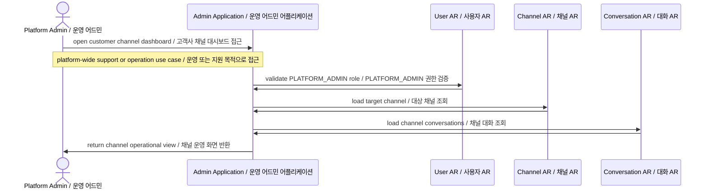

# 🔄 Sequence Diagram / 시퀀스 다이어그램

## 고려사항 / Design Notes

- Focus on actor flow and aggregate interaction.  
  행위자 흐름과 aggregate 상호작용에 집중합니다.
- Describe only the successful path first.  
  우선 성공 경로만 기술합니다.
- Use aggregate/application level participants instead of low-level infra details.  
  저수준 인프라보다 aggregate/application 레벨 참여자를 사용합니다.
- Application layer handles coordination(Orchestration); aggregate handles invariants.  
  Application 레이어가 중심에서 Orchestration을 담당하고, aggregate가 불변식을 처리합니다.
- Center the document around Platform Admin, Channel User, and ChannelEndUser.  
  문서는 Platform Admin, Channel User, ChannelEndUser를 중심으로 구성합니다.
- Follow the aggregate boundaries defined in `aggregate-root-design.md`.  
  `aggregate-root-design.md`에서 정의한 aggregate 경계를 따릅니다.
- Distinguish between aggregate state changes and timeline/event recording.  
  aggregate 상태 변경과 타임라인/이벤트 기록을 구분합니다.
- Ticket-related flows are excluded from the current scope and reserved for a future phase.  
  Ticket 관련 흐름은 현재 범위에서 제외하며 추후 단계로 남겨둡니다.

## 1. Channel Creation / 채널 생성

## 2. Invite Channel Staff / 고객사 직원 초대

## 3. Start Conversation from Widget / 위젯에서 대화 시작

## 4. Re-enter Existing Conversation / 기존 대화 재진입

## 5. Move to Dormant / 휴지기 전환

## 6. Platform Admin Accesses Channel Data / 운영 어드민의 고객사 데이터 접근

