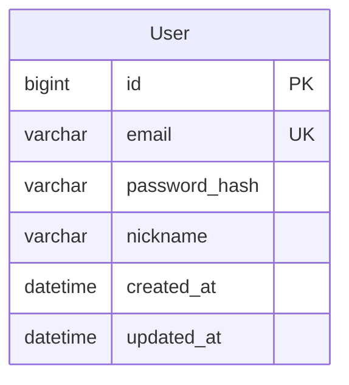
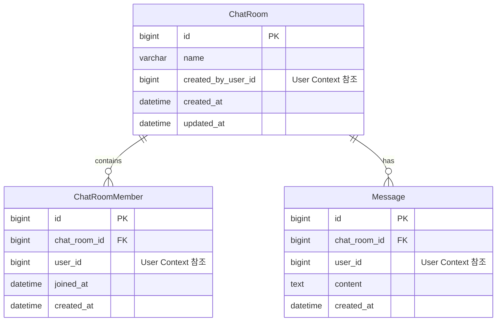

# 패치노트 - 2026-01-06

## 목표했던 내용 1

- README 요구사항을 달성하기 위한 데이터 구조 설계

## 변경사항 1

- 데이터 구조도 작성 (Mermaid ER Diagram)
- 바운더리 컨텍스트 기반 설계
  - User Context: 사용자 인증/인가
  - Chat Context: 채팅방, 멤버, 메시지

---

## 데이터 구조 설계

### 바운더리 컨텍스트 (Bounded Context)

1. **User Context**: 사용자 인증/인가 및 사용자 정보 관리
2. **Chat Context**: 채팅방, 멤버, 메시지 관리

각 컨텍스트는 독립적인 데이터 모델을 가지며, ID 참조를 통해 통신합니다.

### ER Diagram by Bounded Context

#### 1. User Context

#### 2. Chat Context

### 엔티티 상세

#### User Context
- **User**: id, email, password_hash, nickname, created_at, updated_at

#### Chat Context
- **ChatRoom**: id, name, created_by_user_id, created_at, updated_at
- **ChatRoomMember**: id, chat_room_id, user_id, joined_at, created_at
- **Message**: id, chat_room_id, user_id, content, created_at

### 인덱스 전략

- **User**: email (UNIQUE)
- **ChatRoom**: created_by_user_id
- **ChatRoomMember**: (chat_room_id, user_id) UNIQUE, user_id, chat_room_id
- **Message**: (chat_room_id, created_at DESC), user_id

### 확장 고려사항

- **캐싱**: Redis 활용 (세션, 사용자 정보, 채팅방 정보)
- **이벤트**: Phase 3에서 Kafka 도입
- **검색**: Phase 3에서 Elasticsearch 도입 (Message content)
- **분리**: Phase 3에서 Message Service 독립 분리 가능

